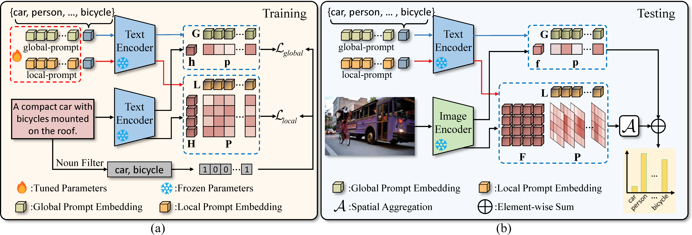

# Texts as Images in Prompt Tuning for Multi-Label Recognition


## Introduction

This repo is the official implementation of **Texts as Images in Prompt Tuning for Multi-Label Recognition**.

Contact us with zixian_guo@foxmail.com


<center>


Fig.1 Overview of Text-as-Image (TaI) prompting.
</center>

## Install

The code is built on the [CoOp](https://github.com/KaiyangZhou/CoOp) and [Dassl](https://github.com/KaiyangZhou/Dassl.pytorch).

<!-- , so you need to install the dassl environment first. You can follow the [instructions](https://github.com/KaiyangZhou/Dassl.pytorch#installation) to install *dassl* as well as *PyTorch*. After that, run `pip install -r requirements.txt` under `UPL/` to install a few more packages required by [CLIP](https://github.com/openai/CLIP). -->

<!-- **We also prepare all installation commands for you**: -->

```bash
# Clone this repo
git clone https://github.com/guozix/TaI-DPT.git
cd TaI-DPT

# install Dassl
cd Dassl.pytorch-master/

# Create a conda environment
conda create -n dassl python=3.7

# Activate the environment
conda activate dassl

# Install dependencies
pip install -r requirements.txt

# Install torch (version >= 1.7.1) and torchvision
conda install pytorch==1.8.1 torchvision==0.9.1 cudatoolkit=10.1 -c pytorch

# Install this library (no need to re-build if the source code is modified)
python setup.py develop

cd ..

# Finished
```

<!-- ## Datasets

After that, you can follow the [CoOp Datasets Instructions](https://github.com/KaiyangZhou/CoOp/blob/main/DATASETS.md) to prepare the datasets. 

Then, you can run the code ~ -->

## Training

``` bash
bash main.sh voc2007_distill rn50_fixscale end 16 16 False voc2007_caption_distill_abinf 0 6
```
<!-- 
### UPL train 

After `get info` step, we can train the prompt (default run 16 seeds, you can change it in `UPL/configs/UPLTrainer/rn50_ep50.yaml`):

```python
CUDA_VISIBLE_DEVICES=0 bash upl_train.sh sscaltech101 rn50_ep50 end 16 16 False True rn50_random_init
```

If you want to use *UPL**, please change the `PSEUDO_LABEL_MODELS` in  `UPL/configs/UPLTrainer/rn50_ep50.yaml`. Please ensure that you have obatined info from all released models. Then, you can run

```python
CUDA_VISIBLE_DEVICES=0 bash upl_train.sh sscaltech101 rn50_ep50 end 16 16 False True multiple_models_random_init
``` -->

<!-- 
## Testing

### Test with existing files after UPL training

```python
bash upl_test_existing_logits.sh sscaltech101 rn50_ep50 end 16 16 False True
``` -->

## Thanks

We use code from [CoOp](https://github.com/KaiyangZhou/CoOp) and [Dassl](https://github.com/KaiyangZhou/Dassl.pytorch), which are great repositories and we encourage you to check them out and cite them in your work.